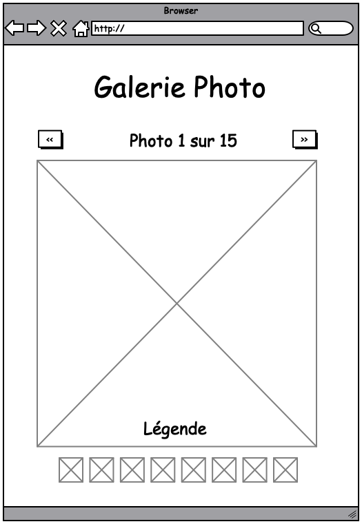

# Galerie photo

L'objectif de ce projet est de réaliser un composant React affichant une galerie photo.
Le composant acceptera les props suivantes :

- dataSource : un tableau ordinal d'objets contenant les propriétés suivantes :
  - legend : la légende de l'image
  - source : le chemin vers l'image, ce chemin peut être un url pointant vers une ressource externe
- title : Le titre de la galerie

## Fonctionnalités

- La galerie affiche une image avec sa légende, sa position dans la série et le nombre total d'images dans la série
- Des boutons "suivant" et "précédent" permettent de naviguer et de changer l'image affichée
- En bas de la galerie, une série de vignettes permet d'accéder directement à toute image de la série

## Maquette

